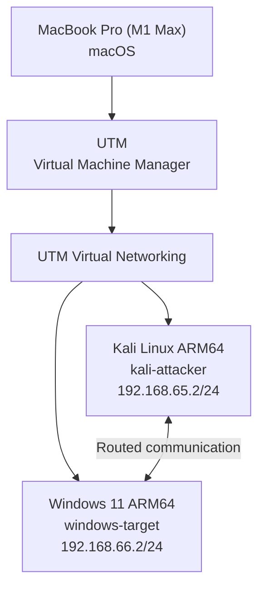
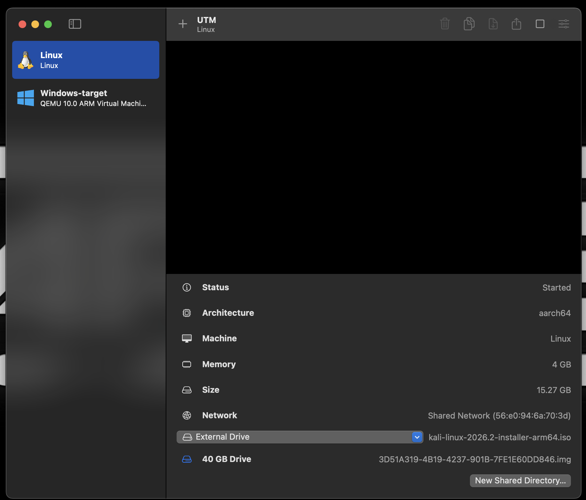
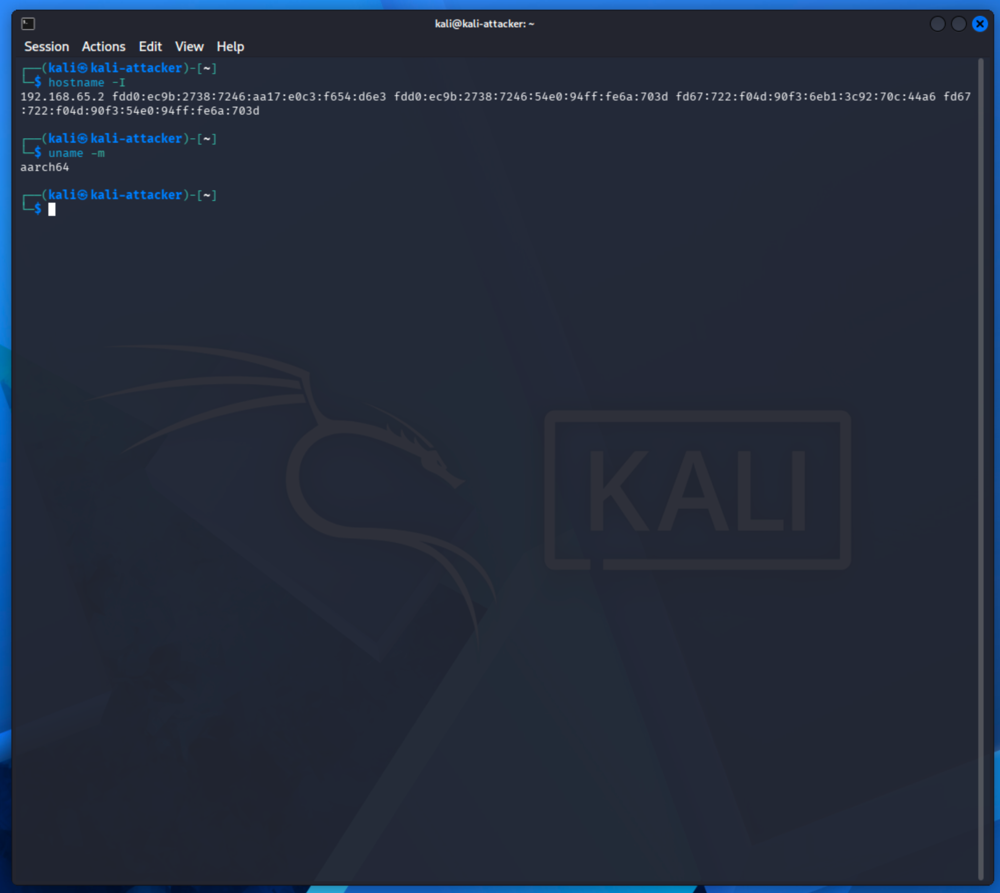
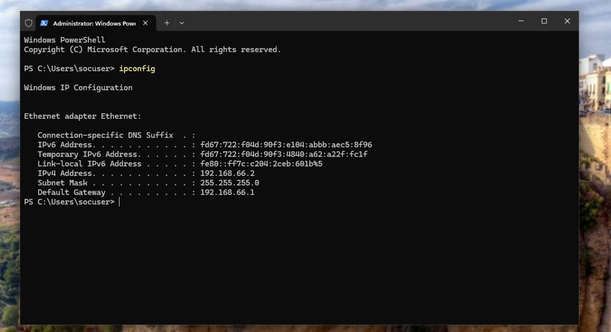
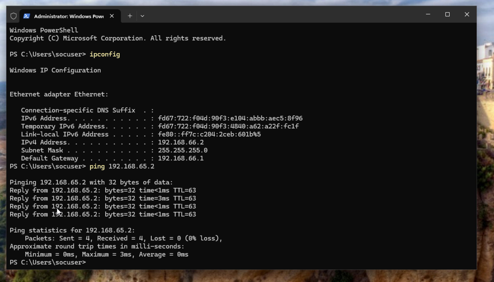
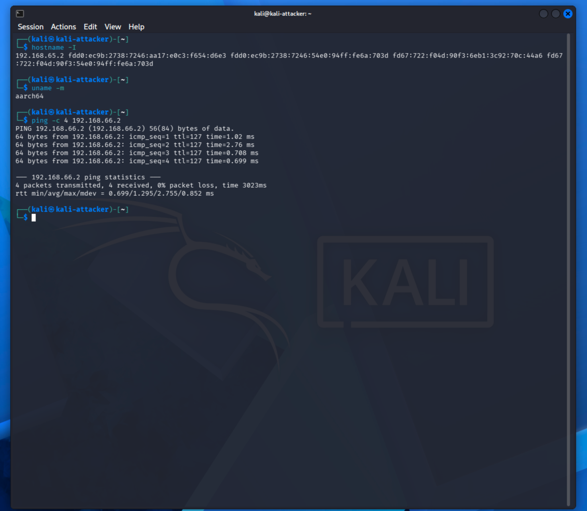

# SOC Home Lab Portfolio

A hands-on home SOC lab built on an Apple Silicon Mac using **UTM**, **Kali Linux ARM64**, and **Windows 11 ARM64**.

The goal of this project was to build two virtual machines, configure virtual networking, verify two-way communication, and troubleshoot a real Windows Firewall connectivity issue. This repository represents the completed first project in my cybersecurity home-lab portfolio.

## Architecture



> The IPv4 addresses shown above are the addresses observed during testing. UTM assigns addresses dynamically, so they can change after a restart.

## Lab Environment

| Component | Configuration |
| --- | --- |
| Host | Apple MacBook Pro, M1 Max |
| Hypervisor | UTM |
| Kali VM | Kali Linux ARM64 / aarch64 |
| Windows VM | Windows 11 ARM64 |
| Kali hostname | `kali-attacker` |
| Windows VM name | `windows-target` |
| Kali RAM | 4 GB |
| Windows RAM | 8 GB |
| Windows CPU | 4 cores |
| Kali virtual disk | 40 GB |
| Windows virtual disk | 64 GB |
| Networking | UTM Shared Networking |

## Network Configuration

During the successful connectivity test:

- Kali: `192.168.65.2/24`
- Kali gateway: `192.168.65.1`
- Windows: `192.168.66.2/24`
- Windows gateway: `192.168.66.1`

The VMs were assigned to separate private subnets, and UTM routed traffic between them.

## Connectivity Testing

### Windows to Kali

From Windows:

```powershell
ping 192.168.65.2
```

Result: **successful** - 4 packets sent, 4 received, 0% loss.

### Kali to Windows

From Kali:

```bash
ping -c 4 192.168.66.2
```

Result: **successful** - 4 packets transmitted, 4 received, 0% packet loss.

## Troubleshooting

The Windows-to-Kali ping worked first, but Kali-to-Windows initially received no replies.

That showed that the virtual network and routing path were working while inbound traffic to the Windows host was being filtered.

I added a targeted Windows Firewall rule to allow inbound ICMPv4 echo requests:

```powershell
netsh advfirewall firewall add rule name="HomeLab ICMPv4" dir=in action=allow protocol=icmpv4:8,any profile=any
```

After adding the rule, Kali successfully received ICMP replies from the Windows VM.

This demonstrated the difference between:

- network/routing connectivity;
- endpoint firewall filtering;
- one-way versus two-way reachability.

## Screenshots

### UTM virtual machines



### Kali network and architecture



### Windows network configuration



### Windows to Kali connectivity



### Kali to Windows connectivity



## What I Learned

- How to create ARM64 virtual machines on Apple Silicon with UTM.
- How to install Kali Linux and Windows 11 in a virtual lab.
- How to inspect IP addressing and routing on Linux and Windows.
- How to distinguish a routing problem from a host firewall problem.
- How UTM can route traffic between separate private virtual subnets.
- How to create a specific Windows Firewall rule rather than disabling the firewall.
- How to verify two-way connectivity with ICMP.

## Project Status

**Complete**

- [x] Kali Linux ARM64 VM
- [x] Windows 11 ARM64 VM
- [x] UTM virtual networking
- [x] Windows to Kali connectivity
- [x] Kali to Windows connectivity
- [x] Windows Firewall troubleshooting
- [x] Architecture documented
- [x] Screenshots committed to repository

## Portfolio Structure

This repository is intentionally kept focused on the **virtual lab and networking foundation**. More advanced exercises such as SIEM deployment, packet analysis, identity management, Linux services, and SOC investigations will be built as separate repositories so each project can stand on its own.

---

**Project 1 complete.**
